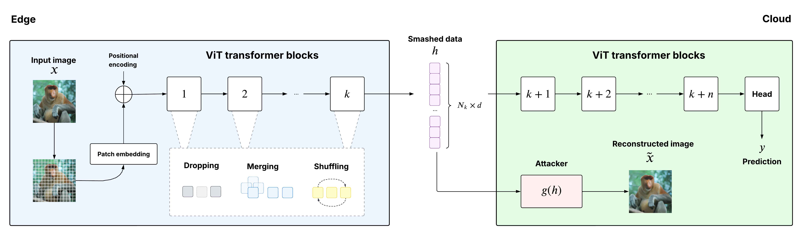

# Position Matters: Feature Inversion Attacks in ViT Split Inference with Token Reduction and Shuffling

This is the repo of the position matters paper. Here you can find a jupyter notebook demo.

Interactive notebook demonstrating the **SARA reconstruction attack** and two privacy defenses
(**PE-Removal Progressive** and **Adversarial**) on split ViT-B/16 and MAE-B/16.

---

## Visualize DEMO results without running it

You can also inspect the demo notebook **without running it**. Opening `position-matters/demo.ipynb` in Jupyter is enough to view the reconstruction results already saved in the notebook outputs, even if the checkpoint files are not present locally.

---

The figure below illustrates the threat model. During split inference, the edge device transmits the smashed data $h$ to the cloud. An honest-but-curious attacker intercepts this intermediate representation and attempts to reconstruct the original input image, denoted by $\tilde{x}$.



---

## 1 · Checkpoints

The `.pth` checkpoints used by the notebook are **not included** in this repository.
They are too large to be stored directly in the GitHub repo.

If you already have the main project checkpoints in the parent repository, copy them into
`position-matters/saved_models/` with:

```bash
bash position-matters/copy_checkpoints.sh
```

If you do **not** have the checkpoints, they must be **regenerated** from the scripts in
`reference_scripts/`.

---

## 2 · Regenerate the checkpoints

The folder `reference_scripts/` contains the training and evaluation scripts corresponding to the
checkpoints used by `demo.ipynb`.

The relevant groups are:

- `reference_scripts/vit/base_decoder/`: baseline decoder checkpoints used in the `Baseline` column
- `reference_scripts/vit/sara/`: SARA attacker checkpoints for the undefended setting
- `reference_scripts/vit/pe_removal_progressive/`: client and SARA checkpoints for the defense setting
- `reference_scripts/vit/adversarial/`: client and SARA checkpoints for the defense + adversarial setting
- `reference_scripts/mae/...`: the corresponding MAE-B/16 versions used when `MODEL = "mae"`

If you want you can change the hyperparameters as you want, anyway there are the default one already setted.

Checkpoint regeneration follows the same dependency order as in the main project:

### ViT-B/16

1. Train the baseline decoder:

```bash
python position-matters/reference_scripts/vit/base_decoder/train_decoder.py --cuda 0
```

2. Train the undefended SARA attacker:

```bash
python position-matters/reference_scripts/vit/sara/train_sara.py --cuda 0
```

3. Train the PE-Removal Progressive client:

```bash
python position-matters/reference_scripts/vit/pe_removal_progressive/train_client.py --cuda 0
```

4. Train the PE-Removal Progressive SARA attacker:

```bash
python position-matters/reference_scripts/vit/pe_removal_progressive/train_sara.py --cuda 0
```

5. Train the adversarial client:

```bash
python position-matters/reference_scripts/vit/adversarial/train_client.py --cuda 0
```

6. Train the adversarial SARA attacker:

```bash
python position-matters/reference_scripts/vit/adversarial/train_sara.py --cuda 0
```

### MAE-B/16

You can find the same scripts for mae in `reference_scripts/mae`.
Before running it be sure to fine tune the mae vit with with:

```bash
python position-matters/reference_scripts/mae/train_linear_probe_last_block.py --cuda 0
```

---

## 3 · Create the environment

### Option A — conda

```bash
conda create -n position-matters python=3.11 -y
conda activate position-matters
pip install -r requirements.txt
```

### Option B — venv

```bash
python3.11 -m venv .venv
source .venv/bin/activate
pip install -r requirements.txt
```

---

## 4 · Add demo images

Drop any `.jpg` or `.png` files into the `images/` folder:

No ImageNet required — any images work.

---

## 5 · Register the kernel and launch

```bash
conda activate position-matters
python -m ipykernel install --user \
    --name position-matters \
    --display-name "Python (position-matters)"
cd position-matters
jupyter notebook demo.ipynb
```
